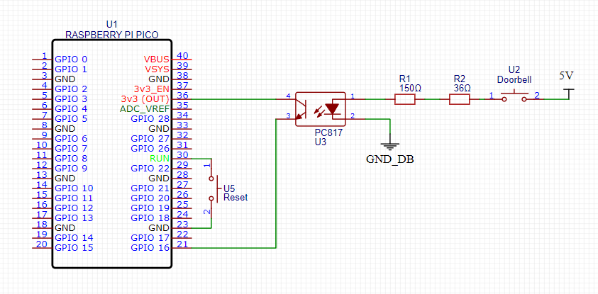

# PicoDoorBell

Doorbell notifier powered by Raspberry Pi Pico W and Telegram.


<a href='https://ko-fi.com/A623L7G' target='_blank'></a> 
[](https://raw.githubusercontent.com/Mauker1/PicoDoorBell/main/LICENSE)

---

# Setting up the project

This project works by sending a notification through a Telegram bot. You could send it directly to your user or a group/channel.

### Hardware list

- 01 Raspberry Pi Pico W
- 01 180 ohms resistor.
- 01 5.1 ohms resistor.
- 01 push button for reset.
- 01 toggle switch for power.
- 01 [PC817 optocoupler](https://www.reichelt.de/optokoppler-fototransistorausgang-5-3-kv-ctr-100-200-dip-4-sfh-617a-3-vis-p216809.html).
- Your doorbell :D Mine is a Ritto Twinbus 7630 indoor.
- 01 USB-C battery charger - [DEBO1 3.7LI 1.0A](https://www.reichelt.de/de/de/entwicklerboards-ladeplatine-fuer-3-7v-li-akkus-usb-c-1a-debo1-3-7li-1-0a-p291398.html) - Based on the TC4056 chipset (**Optional** and not present on V1.0 and V1.1).
- 01 [150 mAh lipo battery](https://www.amazon.de/VinCorp-150mAh-Stecker-Empf%C3%A4nger-Quadrocopter/dp/B086B8NRQ4) (**Optional** and not present on V1.0 and V1.1).

**DISCLAIMER:** Even though this project works fine for me and with my specific doorbell, it doesn't mean it will work with any system. This project does not come with any guarantee whatsoever. If you want to implement this, do it at your own responsibility and risk.

### Schematics


#### V 1.1 schematics



#### Prototype schematics (With battery)


### Render


### Image gallery

Check more pictures [here.](gallery.md)

### Gerber file

If you want to order your own PCB, grab the [Gerber file here.](assets/Gerber_PicoDoorbell_PCB_PicoDoorbell_2024-07-11_02.zip) You can either solder the Pico directly to this board, or add some female headers for an easy Pico swap.

### Getting the code

Clone this repository and make the necessary changes as stated in the following sections.

### IDE

I have used the Thonny IDE, version 4.1.4, to code this project. You can [download it here.](https://thonny.org/)

Alternatively, if you're coding on a Raspberry Pi system, you can run on your terminal:

```
sudo apt update && sudo apt install thonny
```

### Setup the Micropython environment

If your Raspberry Pi Pico W is already flashed with MicroPython, skip to the next step. Otherwise:

- Download the latest Pico W EF2 file [here](https://micropython.org/download/rp2-pico-w/rp2-pico-w-latest.uf2) - Please note this **only** works with the Raspberry Pi Pico W. If you have the board without Wi-Fi **do not** flash it with this file.
- Before plugging your Pico into your computer, locate and press the BOOTSEL button on the board and hold it.


- With the button still pressed, connect your device. It should mount as a mass storage device on your computer, named PI-RP2.
- Drag and drop the EF2 file into the PI-RP2 storage. After it finishes copying, it will automatically unmount from your computer. Don't worry when it does; this is entirely normal.
- And you're done. Your Pico W is now ready to run MicroPython code :)

For more information, please check the [official documentation](https://www.raspberrypi.com/documentation/microcontrollers/micropython.html) on the Raspberry Pi Foundation website.

### Setup Thonny with your Pico W

After flashing your Pico W with MicroPython, make sure it's connected to your computer, open Thonny, and then click on the bottom right corner of the IDE. Choose "MicroPython (Raspberry Pi Pico)" in the drop-down menu.

For more information on setting up Thonny, please see the [official documentation here.](https://datasheets.raspberrypi.com/pico/raspberry-pi-pico-python-sdk.pdf)

### Adding the code to your Pico W

After setting everything up, all you need to do is copy & paste the contents of the `main.py` file into Thonny and save it. Do the same with the `secrets.py` file. **But don't run the code just yet**. We still need to create a bot on Telegram and change the placeholders in the `secrets.py` file.

## Setting up the Wi-Fi

The code on `main.py` is already handling the Wi-Fi network connection. All you need to do is replace both the `ssid` and `pw` inside the `secrets.py` file with your network name and password, respectively.

## Setting up the Telegram bot

Since this project works on top of Telegram, we need to create a bot for it.

First of all, open Telegram and find the BotFather. Or [click here](https://t.me/botfather) to be redirected to it.

As stated in the [official documentation](https://core.telegram.org/bots#6-botfather), do the following after starting the chat with the BotFather:

> Use the `/newbot` command to create a new bot. The BotFather will ask you for a name and username, then generate an authentication token for your new bot.
> 
> The **name** of your bot is displayed in contact details and elsewhere.
>
> The **username** is a short name to be used in mentions and t.me links. Usernames are 5-32 characters long and are case insensitive but may only include Latin characters, numbers, and underscores. Your bot's username **must** end in 'bot', e.g. 'tetris_bot' or 'TetrisBot'.
>
> The token is a string along the lines of `110201543:AAHdqTcvCH1vGWJxfSeofSAs0K5PALDsaw` that is required to authorize the bot and send requests to the [Bot API](https://core.telegram.org/bots/api). Anyone can use it to control your bot. Keep your token secure and store it safely.

Get the generated token and replace it inside `secrets.py` under the `botToken` key.

### Choosing where to send the messages

Now choose if you want to send the notifications directly as a DM or through a channel on Telegram.

#### Sending the notification as a DM

To make the bot send a message to yourself, you first need to send a message to it. Otherwise, it won't be able to send you any messages. This **must**  before anything else. After you send the message, you need to get your user ID on Telegram. To do so, use [this bot.](https://t.me/userinfobot); once it answers you, get the ID and replace it under the `telegramDmUid` key inside the `secrets.py` file.

#### Sending the notification in a channel

You can also use a Telegram channel to relay notifications to many users. First, you must create the Telegram channel and add anyone who may want to receive the alerts. Also, add your bot to this channel as an Admin. After setting everything up, send a message on your channel so your bot can "see it."

Now you need to get the channel ID. To do so, Go to https://api.telegram.org/bot{TOKEN}/getUpdates and replace `{TOKEN}` with your bot's token. The URL will show you a JSON response with all the messages in this channel and the channel details. Please locate the channel ID inside this response. The ID should start with a minus symbol (-). Copy that ID and replace it under the `telegramDmUid` key inside the `secrets.py` file.

For more information on any of the steps above, please refer to the official [Telegram Bot Documentation.](https://core.telegram.org/bots)

#### Dumping the device logs

To make the bot dump the device inner log, you may send a message with the command `/log` in the chat you configured your bot to send the messages. The bot queries for commands **every minute**. This will also clear the internal logs.

**OBS.:** The device will store at most 10000 characters in the log, if it reaches that size, it'll stop appending new messages until the log is flushed.

---

When you have all the placeholders replaced inside `secrets.py`, you may run the code on Thonny. Have fun! :)


## Final details 

- The GPIO that I used as an input to detect the button press was `GP16`, you may chose a different one to fit your project. You can change that inside `main.py`.
- You can also send the startup and alert message inside `main.py`, look for the variables named `startupText` and `text`.
- I am running this project on Germany, you can change the country configuration inside `main.py` as well. Look for `rp2.country('DE')`.
- In my project I am using an optocoupler to detect the signal from my doorbell, since it runs on a different voltage than my Pico W. The doorbell sends a signal at 5V and the Pico W runs at 3.3V. I used the PC817 optocoupler with a 185Ω equivalent resistor. You can check [the datasheet here.](https://www.farnell.com/datasheets/73758.pdf)
